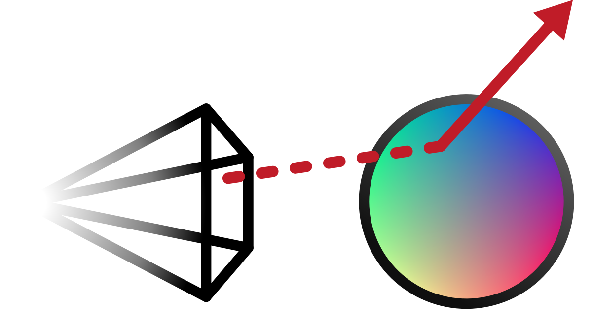
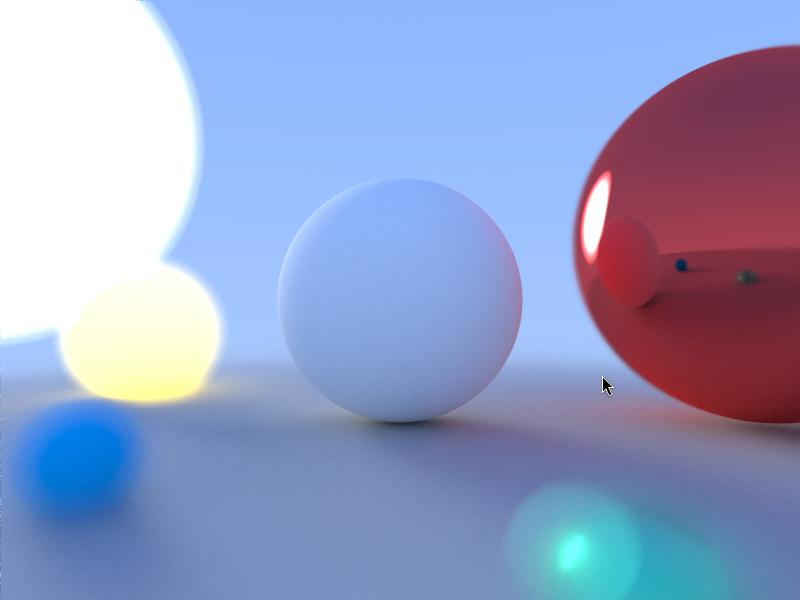
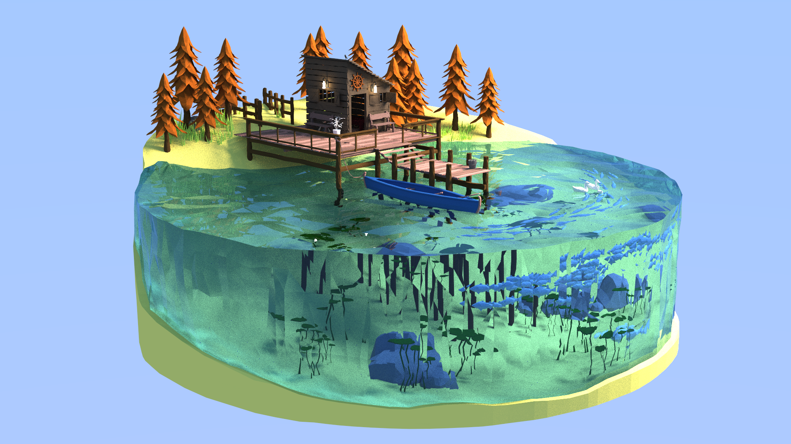

<div align="center">
    
    <h1>Vulkan Ray Tracer</h1>
</div>

The goal of this project is to build a moderately capable ray tracer, able to render sphere and triangle meshes with various material types, using the GPU API Vulkan to interface with the GPU.

## Context
A common project to get programmers familiar with photorealistic rendering is to build
a ray tracer, which is a program that simulates the path that individual light rays would take in a scene, and is able to output realistic-looking images because of it.

The main disadvantage of ray tracing is its speed, or rather lack of, as calculating the paths of all of the rays can become very expensive, especially if running on a CPU.

However, ray tracing can also be considered an [Embarassingly Parallel](https://en.wikipedia.org/wiki/Embarrassingly_parallel) problem, meaning that it can scale incredibly well with parallelization. This renders it an ideal candidate to be executed on graphics cards.

## Dependencies
As it stands, the project depends on the `glfw`, `vulkan`, and `yaml-cpp` system libraries.

GLFW version 3.4 is required for the project to work properly on modern desktop environments.

To install on Fedora:
```bash
sudo dnf install vulkan glfw glfw-devel yaml-cpp yaml-cpp-devel
```
To install on Debian:
```bash
sudo apt install libvulkan1 mesa-vulkan-drivers yaml-cpp libyaml-cpp-dev libglfw3 libglfw3-dev
```
To install on Arch:

Replace [your vulkan drivers] based on [your device](https://wiki.archlinux.org/title/Vulkan)
```bash
sudo pacman -S [your vulkan drivers] yaml-cpp glfw
```

#### Vulkan SDK
To be able to use all the validation layers, the full Vulkan SDK is needed, which can be installed at: https://www.lunarg.com/vulkan-sdk/

Alternatively, you can use your package manager's versions, but your mileage may vary.

## Building and Running

The project is compiled and run by the included make file:

```bash
make compile    # to compile the project
make run        # to run it
```
## File formats
The program uses two different file formats to load and render the various scenes:

### Parameters
This file contains all of the various parameters needed by the ray tracer to load a scene and trace it.

The `max_bvh_depth` parameters requires it to be changed in `src/shaders/util/parameters.comp`. The shaders need to be recompiled after that.
```yaml
# WARNING: Some of these parameters need the shaders parameters to be tweaked accordingly.
#          Please update the appropriate parameters in src/shaders/util/parameters.comp

# General parameters
scene_file: "scenes/cornell.yaml"     # file from which the scene will be loaded
shader_dir: "build/shaders"           # directory containing compiled shaders
tile_size: 8                          # size of tiles used for rendering.

# Vulkan parameters
use_llvmpipe: false                   # forces the rendering to happen on the CPU
use_validation_layers: false          # enables vulkan validation layers
validation_layers:                    # list of enabled validation layers
  - "VK_LAYER_KHRONOS_validation"     #  - standard error checking
  - "VK_LAYER_LUNARG_api_dump"        #  - dump in stdout API calls

# BVH parameters
max_bvh_depth: 64                     # maximum depth of the tree
bvh_split_attempts: 8                 # amount of splits performed to find the optimal BVH.
                                      #  set to -1 to attempt all possible splits.

# Output parameters
offscreen_rendering: false            # enable to render on headless devices
dump_file: "./dump.raw"               # file where the final framebuffer will be dumped
frame_count: -1                       # number frames to render before dumping the output
                                      #  set to -1 to let render indefinitely
```

### Scene file
This file represents a full scene to be ray traced:
```yaml
version: '0.2'

camera:
  resolution: [800, 600]
  focal_length: 1.0
  focus_distance: 4.8
  aperture_radius: 0.2
  location: [0, 0, 0]
  rotation: [0, 0, 0]

scene:
- type: Sphere
  material:
    base_color: [0.5, 0.5, 0.5]
    emission: [15, 6, 5]
    reflectiveness: 0.96
    roughness: 0.43
    ior: 1.45
    is_glass: false
    smooth_shading: false
    motion_blur: [0, 1.3, 0.4]
  data:
    radius: 99
    center: [0, -100, 0]

- type: TriMesh
  material:
    base_color: [1, 0.99, 0.9]
  data:
    vertices: [1, 2, 3, ...]
    normals: [4, 5, 6, ...]
```
## Screenshots
These showcase the depth of field as well as various materials such as glass.

<div align="middle" float="left">
    
    
</div>
The right screenshot is a render of "Low Poly Lake Scene" by EdwiixGG on Sketchfab

## References
- [Ray Tracing Gems](https://www.realtimerendering.com/raytracinggems/rtg/index.html)
- [Ray Tracing in a Weekend](https://raytracing.github.io/books/RayTracingInOneWeekend.html)
- [Ray Tracing the Next Weekend](https://raytracing.github.io/books/RayTracingTheNextWeek.html)
- [Vulkan Tutorial](https://vulkan-tutorial.com/)
- [The blog at the bottom of the sea](https://blog.demofox.org/2020/05/16/using-blue-noise-for-raytraced-soft-shadows/)
- [Fast, Minimum Storage Ray/Triangle Intersection](https://www.graphics.cornell.edu/pubs/1997/MT97.pdf)
- [Practical Hash-based Owen Scrambling](https://jcgt.org/published/0009/04/01/)
- [TU Wien Ray Tracing resources](https://www.iue.tuwien.ac.at/phd/ertl/node4.html)
- And many more...
